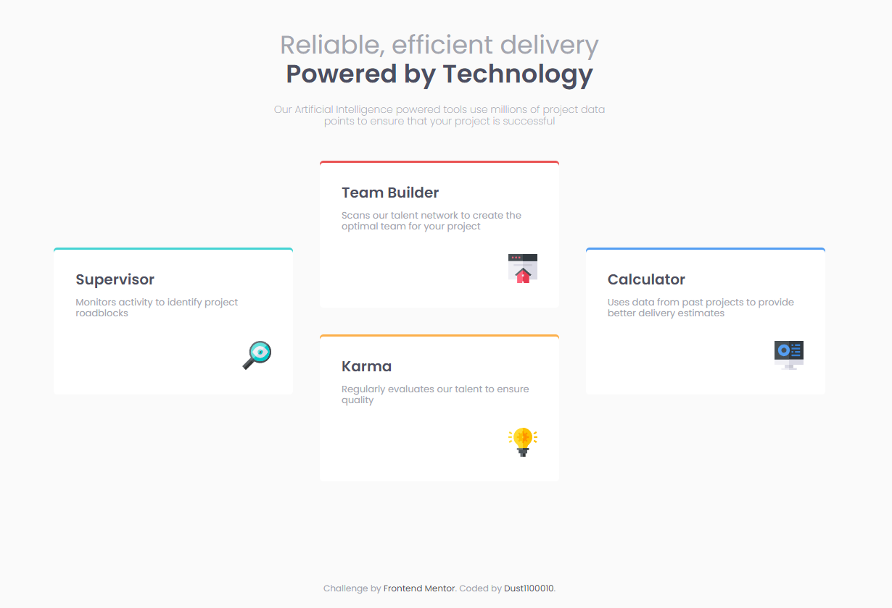

# Frontend Mentor - Four card feature section solution

This is a solution to the [Four card feature section challenge on Frontend Mentor](https://www.frontendmentor.io/challenges/four-card-feature-section-weK1eFYK). Frontend Mentor challenges help you improve your coding skills by building realistic projects. 

## Screenshot

A screenshot of my solution. \o/

- Live Site URL: https://fourcardsection-ver1.netlify.app/

## Built with

- HTML
- CSS
- Grid
- BEM
- Flex

## Author

- Twitter: https://www.twitter.com/dust98mc

